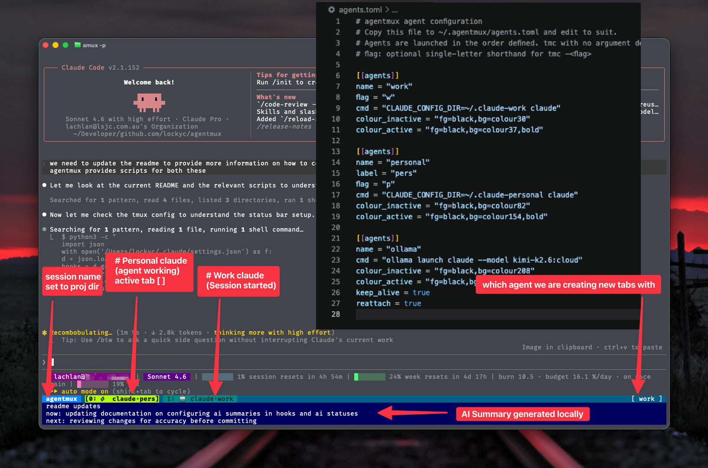

# agentmux

Configurable tmux agent launcher. Define AI agents (or any CLI) in TOML; sessions auto-launch the correct agent, tabs are colour-coded per agent, and `prefix-m` cycles through the list.



## Prerequisites

- tmux
- `toml2json`: `brew install go-toml`
- `jq`: `brew install jq`
- LM Studio on `localhost:1234` (optional — for AI summary status lines)
- `reattach-to-user-namespace` (optional, macOS — only if using `reattach = true` in agents.toml)
- `osascript` (optional, macOS — only for `--notify` desktop alerts in the Claude Code hooks)

## Install

```bash
git clone https://github.com/lockyc/agentmux ~/agentmux
cd ~/agentmux
bash install.sh
```

Edit `~/.agentmux/agents.toml` to define your agents, then add to your shell config and tmux config as directed by the installer output.

## Usage

| Command | Effect |
|---|---|
| `amux` | New/attach session, default agent (first in list) |
| `amux -<flag>` | New/attach session, agent matching flag (e.g. `-w` for `flag = "w"`) |
| `amux <name>` | New/attach session, agent by name |
| `amux <name> <session>` | New/attach named session with specified agent |
| `tm [name]` | Plain tmux session, no agent |
| `prefix-c` | New tab, auto-launches current `@agent-mode` agent |
| `prefix-m` | Cycle `@agent-mode` through defined agents |
| `prefix-x` | In agentmux sessions: respawn + relaunch agent (last pane); otherwise kill-pane |

## Adding an agent

Add a new `[[agents]]` block to `~/.agentmux/agents.toml`:

```toml
[[agents]]
name = "myagent"
flag = "a"
cmd = "my-ai-cli"
colour_inactive = "fg=black,bg=colour56"
colour_active   = "fg=black,bg=colour93,bold"
```

The new agent appears in the `prefix-m` cycle immediately (no reload needed).

## Optional per-agent fields

| Field | Default | Effect |
|---|---|---|
| `flag` | — | Single-letter shorthand for `amux -<flag>` |
| `label` | name | Short display name used in tmux tab labels (e.g. `label = "pers"` for a `name = "personal"` agent) |
| `keep_alive` | false | Appends `; exec $SHELL` so the tab stays open after the agent exits |
| `reattach` | false | Uses `reattach-to-user-namespace` (macOS clipboard fix); requires `keep_alive = true` |

## AI tab states (Claude Code)

`claude/status.sh` updates the tmux tab label with an emoji reflecting Claude's current state:

| Emoji | State |
|---|---|
| 🤖 | Session started |
| ⚡ | Working |
| 🔐 | Awaiting permission |
| 📣 | Waiting for input |
| ✅ | Done (unseen) |
| 👀 | Done (window active/seen) |

**Setup:** `install.sh` copies the `scripts/claude/` directory to `~/.agentmux/scripts/claude/` automatically. Wire the hooks in `~/.claude/settings.json`:

```json
{
  "hooks": {
    "SessionStart":      [{ "hooks": [{ "type": "command", "command": "~/.agentmux/scripts/claude/status.sh start" }] }],
    "UserPromptSubmit":  [{ "hooks": [{ "type": "command", "command": "~/.agentmux/scripts/claude/status.sh working" }] }],
    "PostToolUse":       [{ "hooks": [{ "type": "command", "command": "~/.agentmux/scripts/claude/status.sh working" }] }],
    "Notification":      [{ "hooks": [{ "type": "command", "command": "~/.agentmux/scripts/claude/status.sh notify" }] }],
    "PermissionRequest": [{ "hooks": [{ "type": "command", "command": "~/.agentmux/scripts/claude/status.sh permission --notify 'Claude is waiting for permission'" }] }],
    "Stop":              [{ "hooks": [{ "type": "command", "command": "~/.agentmux/scripts/claude/status.sh done --notify 'Claude has finished working'" }] }]
  }
}
```

The `--notify` flag triggers a macOS notification via `osascript`. Remove it if you don't want desktop alerts.

## AI summary status lines

The 3-row status bar shows a rolling `done / now / next` summary of the active session. `agentmux.conf` already wires `status-format[1-3]` to `summary_rows.sh`; you just need LM Studio and the Claude Code hooks above.

**Requirements:**
- LM Studio running at `localhost:1234` with a small non-reasoning instruct model loaded (e.g. `qwen2.5-14b-instruct`)
- `agentmux.conf` sourced in `~/.tmux.conf`
- Claude Code hooks wired (above) — the `working` hook triggers the summariser

The 3 extra status rows only appear for sessions started with `amux` (sets `@autoagent=1`). Sessions started with `tm` keep a single status line.

**Pipeline** (runs detached on every `working` hook):
1. `claude/ctx.sh` — extracts recent prose turns from the Claude Code transcript
2. `claude/digest.sh` — compacts the session into a chronological digest (prose + mutating tool actions)
3. `summarise.sh stand` — sends the digest to a local OpenAI-compatible endpoint; receives `"<subject>. done: …; now: …; next: …"`
4. Result written to `/tmp/agentmux-status-<pane_key>.txt`
5. `summary_rows.sh` (called by tmux `status-format[1-3]`) splits that into three display rows

Override the endpoint or model with environment variables (defaults shown match LM Studio; Ollama would use `http://localhost:11434/v1/chat/completions`):

```bash
export AGENTMUX_LLM_URL=http://localhost:1234/v1/chat/completions
export AGENTMUX_LLM_MODEL=qwen2.5-14b-instruct
export AGENTMUX_LLM_TIMEOUT=20   # seconds
```

**Non-Claude agents:** any agent can participate by writing to `/tmp/agentmux-status-<pane_key>.txt` directly (where `pane_key=$(echo $TMUX_PANE | tr -d '%')`). The format is a single line: `<subject>. done: <text>; now: <text>; next: <text>` — any of the `done`/`now`/`next` labels may be omitted.

## Session colours

Each session gets a colour derived deterministically from its name — same directory, same colour, on every machine. The summary rows use a matching shade of the same hue. Colours update automatically on attach; no config needed.

Session names default to `basename $PWD` (dots → underscores). Pass an explicit name with `amux <agent> <name>` to pin a colour regardless of working directory.
