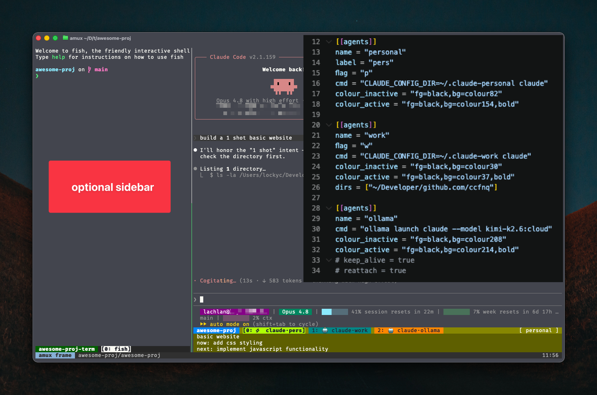

# agentmux

[](https://github.com/Lockyc/agentmux/releases/latest)


[](LICENSE)

Configurable tmux agent launcher. Define AI agents (or any CLI) in TOML; sessions auto-launch the correct agent, tabs are colour-coded per agent, and `prefix m` cycles through the list.




> **Companion project: [warden](https://github.com/lockyc/warden)** — a notification-aware terminal built for this workflow. agentmux's `--notify` hook emits a standard OSC 777 escape *through* tmux; warden surfaces it as a per-tab badge plus a macOS banner tied to the agent that raised it (see [AI tab states](#ai-tab-states-claude-code)). agentmux works in any terminal — warden just makes the notifications first-class.

## Install

### Claude Code (interactive — recommended)

Clone the repo, open it in Claude Code, and run:

```
/agentmux:install
```

The command checks dependencies, runs the installer, and interactively wires your shell config, `~/.tmux.conf`, and Claude Code hooks. It then self-installs to `~/.claude/commands/` so `/agentmux:install` is available globally for future updates from any directory.

### Manual

```bash
curl -fsSL https://raw.githubusercontent.com/lockyc/agentmux/main/install.sh | bash
```

This clones agentmux into `~/.agentmux/` (a git clone — update later with
`amux --update`). You can also clone the repo and run `bash install.sh` directly.

Then complete the setup:

**1. Install dependencies** (if not already present):
```bash
which toml2json || brew install go-toml
which jq        || brew install jq
```

**2. Add to your shell config:**

bash/zsh (`~/.zshrc` or `~/.bashrc`):
```bash
source ~/.agentmux/shell/agentmux.sh
```

fish (`~/.config/fish/config.fish`):
```fish
source ~/.agentmux/shell/agentmux.fish
```

**3. Add to your `~/.tmux.conf`:**
```
source-file ~/.agentmux/tmux/agentmux.conf
```

**4. Edit `~/.agentmux/amux.toml`** to define your agents (created from the example by the installer).

**5. Reload:**
```bash
source ~/.zshrc                  # or restart your shell
tmux source ~/.tmux.conf         # or start a new tmux server
```

**6. Launch your first session:**
```bash
amux
```

## Prerequisites

- tmux
- `toml2json`: `brew install go-toml`
- `jq`: `brew install jq`
- A local OpenAI-compatible LLM endpoint (optional — for AI summary status lines; e.g. LM Studio, Ollama)
- `reattach-to-user-namespace` (optional, macOS — only if using `reattach = true` in amux.toml)
- A notification-aware host terminal (optional — for `--notify` alerts; the hook emits a standard OSC 777 desktop-notification escape, surfaced by hosts like [warden](https://github.com/lockyc/warden) or Ghostty)

## Usage

agentmux is driven two ways: **`amux …` shell commands** you type at a prompt to launch and manage sessions, and **tmux key bindings** you press once you're inside a session. Never used tmux? Read [Inside a session: tmux basics](#inside-a-session-tmux-basics) first — you don't need to know tmux going in.

### amux commands

Normal shell commands — type them at a prompt.

| Command | Effect |
|---|---|
| `amux` | New/attach session; agent auto-selected from the current directory (see below), else the first agent in the list |
| `amux -<flag>` | New/attach session, agent matching flag (e.g. `-w` for `flag = "w"`) |
| `amux <agent>` | New/attach session, agent by name |
| `amux <agent> <session>` | New/attach named session with specified agent |
| `amux --sessions` | List agentmux agent sessions (name, agent, windows, attach state) |
| `amux --log` | Durable roster of agent windows amux has opened, grouped by project — recover sessions lost to a server kill or reboot. Prints one `cd` per project, then a resume command per window tagged `● live` / `✗ lost` |
| `amux --probe [session]` | Exit 0 if a session exists — the agent **or** a lingering frame (default: current dir). Silent; for scripting a presence indicator (e.g. warden's cyan dot) off the exit code |
| `amux --kill [session]` | Kill an agent session **and** its frame + terminal (default: current dir) |
| `amux --kill-all` | Kill every agent session + all frames/terminals (asks first) |
| `amux --update` | Update to the latest agentmux (`git pull --ff-only` of `~/.agentmux`) |
| `amux --colours [grid\|pick]` | Preview the colour palette (curated names + 256 codes). `pick [agent]` interactively builds a paste-ready `colour =` line |
| `amux --frame [agent] [session]` | Side-terminal layout: bare shell (left) + amux (right) as a nested tmux |
| `amux --no-frame` | One-off plain launch when `[frame] default = true` is set (skips the frame) |
| `amux --frames` | List active `--frame` wrappers (they live on a separate tmux socket) |
| `amux --frame-kill [session]` | Tear down a frame (wrapper + its left terminal); the agent keeps running |
| `amux --frame-kill-all` | Tear down ALL frames + scratch terminals at once; agents keep running |

Set `[update] check = true` in `~/.agentmux/amux.toml` to enable a once-daily
check that notifies (notify-only) when a newer agentmux is available on GitHub.

Sessions are named after `basename $PWD` (dots → underscores) by default — run `amux` in your project directory and it picks up the name automatically. Pass an explicit name with `amux <agent> <session>` to override. agentmux sessions get a coloured status bar, AI summary rows, and tab-state emojis; plain tmux sessions are left unstyled.

### Inside a session: tmux basics

`amux` launches your agent inside **tmux**, which keeps the session running in the background — even if you close the terminal window. You drive tmux with a handful of keyboard shortcuts; here's everything you need, no prior tmux knowledge assumed.

**Reading the shortcuts.** `C-b` means *hold Ctrl and tap `b`*. Likewise `C-f` is Ctrl+f. That's the whole notation.

**The prefix.** tmux can't act on its shortcuts directly — they'd collide with the program running inside (your agent wants Ctrl+C, Ctrl+R, and so on for itself). So you first press a **prefix** key to get tmux's attention, *release it*, then press the command key. The default prefix is **`C-b`** (Ctrl+b). When you see `prefix c`, it means: press Ctrl+b, let go, then press `c`. To use a different key for amux sessions, set `[amux] prefix` (e.g. `prefix = "C-a"`) — it applies only to amux's own sessions, not your other tmux work. It can be overridden per-directory with an `[amux.dirs."<path>"]` block, exactly like `[frame.dirs]` (see [Side-terminal layout](#side-terminal-layout---frame)).

**The three keys you'll actually use** — each pressed after the prefix:

- **`c`** — **c**reate a new tab (auto-launches the current agent)
- **`x`** — close the current tab (e**x**it)
- **`d`** — **d**etach: leave everything running in the background and drop back to your shell

**Detaching** is how you step away without stopping the agent. Press `prefix d` (Ctrl+b, then `d`) and your agent keeps working; re-run `amux` in the same directory to reattach. Closing the terminal window detaches too — it never kills the session. (Inside a `--frame` the prefix is `C-f`, so you detach with `C-f d` — see [Side-terminal layout](#side-terminal-layout---frame).)

### tmux key bindings

All of these are pressed **after the prefix** (`C-b` by default).

| Press | Effect |
|---|---|
| `prefix c` | New tab — auto-launches the current `@agent-mode` agent (tmux's built-in new-window key; agentmux just hooks it to launch the agent) |
| `prefix x` | Close the current tab. In an agentmux session's last pane it respawns + relaunches the agent instead of destroying the session; everywhere else it's tmux's kill-pane |
| `prefix d` | Detach — leave the session running and return to your shell |
| `prefix m` | Cycle `@agent-mode` through your defined agents (agentmux sessions only) |
| `prefix v` | Clear the state emoji (✅/📣/⚡…) off the current tab. One-shot — the next status hook re-adds one as normal; use it to acknowledge a done/notify tab. No-op on a tab with no emoji |

### Directory-based agent selection

Give an agent a `dirs` list and a bare `amux` (no flag, no agent name) auto-selects it based on the current directory — no flag or `prefix m` toggle needed:

```toml
[[agents]]
name = "work"
cmd  = "CLAUDE_CONFIG_DIR=~/.claude-work claude"
dirs = ["~/work", "~/clients"]
```

A pattern matches when `$PWD` is that directory or any subdirectory of it (`~/work` covers `~/work/acme/api`). `~` expands to `$HOME`. When more than one agent matches, the longest (most specific) path wins, so you can nest a specific rule inside a broader one. If nothing matches, `amux` falls back to the first agent in the list. An explicit `-<flag>` or `<agent_name>` argument always overrides directory routing.

Matching uses the logical path — `$PWD` as your shell shows it — and symlinks are **not** resolved. Write patterns the way you actually `cd` into the directory (e.g. via the symlink path, not its target).

### Side-terminal layout (`--frame`)

`amux --frame [agent] [session]` puts a persistent scratch terminal in the left
pane beside amux in the right. It's a nested tmux on its own socket
(`agentmux-frame`, session `<session>-frame`), so amux runs completely unchanged
on the right. There are **three status bars**: a thin full-width outer bar (the
frame, showing the project + clock), and a per-pane bar under each side — the left
terminal's own tab bar and amux's. (Requires tmux ≥ 3.1 for the `-l %` split.)

- The **left pane is its own dedicated tmux** on a separate `agentmux-term` socket
  (config `tmux/term.conf`): its own tab bar, and it **never dies** — exit the
  shell and it respawns. It's a bare tmux (not your `~/.tmux.conf`), kept isolated
  on purpose.
- **Prefixes:** the frame uses `C-f` ("f" for frame — `C-f h`/`l` focus left/right,
  `C-f j`/`k` move within the split left column, `C-f H`/`L` resize, `C-f 0` reset the
  split back to `[frame] left`, `C-f Q` quit, `C-f d` detach), overridable via
  `[frame] prefix`. The two inner tmuxes use their
  own prefix (`C-b` by default, or amux's `[amux] prefix` for the right pane), which
  the frame passes through to whichever pane is focused: left → the terminal's tabs,
  right → amux. A stray `prefix d` on either pane is harmless — the pane re-attaches
  in place rather than vanishing (use `C-f d` to detach the whole frame). The `[amux]`
  and `[frame]` prefixes must differ: the frame grabs its own prefix before the inner
  amux can see it, so a colliding `[amux] prefix` is ignored (with a warning).
- Set the left-pane width with `[frame] left = <percent>` (default `30`).
  Optionally split the left column top/bottom with `[frame] left_vertical_split =
  <percent>` (the top region's height, `10`–`90`; unset = single left pane). The
  top region is plain shells; the scratch terminal (with its tab bar) stays in
  the bottom sub-pane — reach the top shells with the mouse. Stack more than one
  shell in the top region with `[frame] left_top_panes = <count>` (`1`–`6`, default
  `1`, equal-height, full-width; needs `left_vertical_split`) — e.g.
  `left_vertical_split = 30` + `left_top_panes = 3` stacks three small shells above a
  larger scratch terminal. Two more layout fields:
  `[frame] focus` picks which pane starts focused — `"agent"` (right, the default)
  or `"terminal"` (the left column); `[frame] status_position` places the frame's
  outer status bar at `"bottom"` (default) or `"top"`. Frame
  config applies when the frame is **created** — a persistent frame keeps its
  layout, so after changing it, tear the frame down (`C-f Q` or
  `amux --frame-kill <session>`) and relaunch. Killing only the agent session
  leaves the wrapper, which reattaches at the old size.
- **Open frames by default.** Set `[frame] default = true` to make a bare `amux`
  (run from a plain terminal) behave like `amux --frame`; use `amux --no-frame` for
  a one-off plain launch. It's ignored when `amux` runs inside an existing tmux (a
  frame can't nest there) — that case falls through to a normal in-tmux launch.
- **Nesting inside tmux.** By default `--frame` refuses to run inside an existing
  tmux: the frame is its own tmux server, so nesting it stacks prefixes (your outer
  `C-b`, the frame's `C-f`, the scratch terminal's). Advanced users already living
  in tmux can opt in with `[frame] allow_nested = true`, which lifts the guard (and
  the `default` skip above, so a default frame opens in-tmux too). The frame's own
  panes already clear `$TMUX`, so the inner amux/terminal still launch cleanly.
- **Per-directory overrides.** Any `[frame]` field can be overridden for a
  directory (and its subtree) with a `[frame.dirs."<path>"]` block — same
  matching as an agent's `dirs` (`~` expands, longest path wins), resolved
  per-field, falling back to the base `[frame]` values. e.g. a taller split that
  starts focused on the terminal in one project:
  ```toml
  [frame.dirs."~/Developer/github.com/lockyc/agentmux"]
  left_vertical_split = 30
  focus = "terminal"
  ```
- Run it from a plain terminal, not from inside tmux. Reattach with the same
  `amux --frame <session>` (a closed pane is rebuilt).
- **Three sessions across three sockets.** `<session>` — your agent, on the
  **default** socket (what plain `tmux ls` shows). `<session>-frame` — the wrapper,
  on `agentmux-frame`. `<session>-term` — the left terminal, on `agentmux-term`.
  The frame is the *outer* layer in the nesting sense, but each lives on its own
  socket so their stripped configs never bleed into your normal tmux — which is
  also why a base-terminal `tmux ls` (default socket) only shows the agent.
- **Managing it from the base terminal:**
  - Leave the frame from inside: `C-f d` (detach, all kept) or `C-f Q` (quit the
    wrapper; the agent survives, reattach later).
  - `amux --frames` — list active frames (no need to remember the socket).
  - `amux --frame-kill [session]` — tear down a frame: both the wrapper and its
    left terminal (default: current dir's). The agent session keeps running.
  - `amux --kill [session]` — kill the whole project: the **agent** session plus
    its frame and terminal (default: current dir's). Use this instead of a raw
    `tmux kill-session` so nothing is left orphaned. `amux --sessions` lists the
    exact session names.

## Adding an agent

Add a new `[[agents]]` block to `~/.agentmux/amux.toml`:

```toml
[[agents]]
name = "myagent"
flag = "a"
cmd = "my-ai-cli"
colour = "green"
```

`colour` is a curated palette name (run `amux --colours` to preview them) or a 256
code like `"colour82"`/`"82"` — agentmux derives the active and inactive tab shades
from it automatically. Run `amux --colours pick myagent` to choose one interactively
and get a paste-ready line. For full manual control, skip `colour` and set the raw
tmux styles instead (see [Optional per-agent fields](#optional-per-agent-fields)).

The new agent appears in the `prefix m` cycle immediately (no reload needed).

## Optional per-agent fields

| Field | Default | Effect |
|---|---|---|
| `flag` | — | Single-letter shorthand for `amux -<flag>` |
| `dirs` | — | List of directories; a bare `amux` run inside one (or any subdirectory) auto-selects this agent. `~` → `$HOME`; longest match wins. See [Directory-based agent selection](#directory-based-agent-selection) |
| `label` | name | Short display name used in tmux tab labels (e.g. `label = "pers"` for a `name = "personal"` agent) |
| `colour` | — | Tab colour as a curated palette name or 256 code (`"green"`, `"colour82"`, `"82"`); the active/inactive shades are auto-derived. Preview with `amux --colours`. Ignored if the raw pair below is set |
| `colour_inactive` / `colour_active` | — | Escape hatch: full raw tmux styles for total control (e.g. `"fg=black,bg=colour56"` / `"fg=black,bg=colour93,bold"`). Set **both** as a pair — they override `colour`, and setting only one is a misconfiguration (agentmux warns) |
| `keep_alive` | false | Appends `; exec $SHELL` so the tab stays open after the agent exits |
| `reattach` | false | Uses `reattach-to-user-namespace` (macOS clipboard fix); requires `keep_alive = true` |
| `resume` | — | Resume program shown by `amux --log` for this agent's windows. Overrides just the executable of the recorded resume command (e.g. `resume = "claude-work"` → `claude-work --resume <id>`); omit to use the program the adapter recorded |

## Adding an agent integration

`amux` and friends launch any CLI from `amux.toml`. The richer integration — tab-state emojis and the AI summary status lines — runs through a per-agent **adapter** that lives at `scripts/<agent>/status.sh`. The shipped Claude Code adapter (`scripts/claude/`) is the reference implementation.

An adapter is a thin shim that:

1. Exports three env vars and execs the shared core (`scripts/tmux-status.sh`):

   | Env var | Purpose |
   |---|---|
   | `AGENTMUX_AGENT_NAME` | Label used in tab and temp-file names (e.g. `claude`, `gemini`) |
   | `AGENTMUX_CTX_BIN` | Path to a transcript context extractor (see below) |
   | `AGENTMUX_DIGEST_BIN` | Path to a transcript digest builder (see below) |

2. Parses whatever hook payload its agent sends and re-exports:

   | Env var | Purpose |
   |---|---|
   | `AGENTMUX_HOOK_PROMPT` | Latest user prompt (working state only) |
   | `AGENTMUX_HOOK_TRANSCRIPT` | Filesystem path to the agent's session transcript (working state only) |

The shared core is hook-schema-agnostic — it consumes only those env vars, never stdin. Hook-payload parsing belongs in the adapter because every agent has a different schema.

Two optional overrides let an adapter swap in custom helpers; defaults work for everyone:

| Env var | Default | Purpose |
|---|---|---|
| `AGENTMUX_TAB_LABEL_BIN` | `~/.agentmux/scripts/tab_label.sh` | Resolves the tab-label suffix from `@window-agent`. Override to render labels differently. |
| `AGENTMUX_SUMMARISE_BIN` | `~/.agentmux/scripts/summarise.sh` | LLM-summary entry point. Override to point at a different summariser. |

**Contracts for `ctx.sh` and `digest.sh`** (both read the transcript path as `$1`):

- `ctx.sh <transcript> <max_msgs> [percap] [head|tail]` — prints prose-only turns joined by ` / `; used to derive the stable subject and to anchor recent activity. Filters out tool noise and pasted dumps.
- `digest.sh <transcript> [start_line] [char_budget]` — prints a chronological digest (prose + mutating tool one-liners) for the done/now/next summariser. Drops oldest prose first when over budget; keeps tool lines.

Both must print nothing and exit 0 on any error — the shared core treats them as cosmetic.

To add e.g. a Gemini CLI adapter: create `scripts/gemini/{status,ctx,digest}.sh` following the Claude versions, wire your agent's hook system to call `~/.agentmux/scripts/gemini/status.sh <state>` with `state` ∈ `start|working|notify|permission|done`, and `install.sh` will pick the directory up automatically.

**Keep custom adapters outside the shipped tree.** `~/.agentmux/` is a git clone and `amux --update` runs `git pull --ff-only`. Because adapters are referenced by absolute path — the hook command plus the `AGENTMUX_CTX_BIN`/`AGENTMUX_DIGEST_BIN` (and other `AGENTMUX_*_BIN`) overrides — they can live anywhere on your filesystem. Put your own under e.g. `~/.agentmux-local/<agent>/` and point your hook command and env-var overrides at those paths. Avoid authoring an adapter under `~/.agentmux/scripts/<name>/` using a name agentmux might later ship: if a future release adds a tracked `scripts/<name>/`, `amux --update` will refuse to proceed rather than overwrite your file, blocking updates until you relocate it.

## Shell support

`amux` works in **bash**, **zsh**, and **fish**. All of the launcher logic lives in a single standalone bash executable — `bin/amux`, the one source of truth — and each interactive shell just sources a thin wrapper that defines the `amux` command and wires tab-completion. The launcher runs as a subprocess, so **bash must be installed**, but it does not have to be your interactive shell.

| Shell | `amux` command | Tab-completion | Integration file | Source from |
|---|---|---|---|---|
| bash | ✓ | — | `shell/agentmux.sh` | `~/.bashrc` |
| zsh | ✓ | ✓ | `shell/agentmux.sh` | `~/.zshrc` |
| fish | ✓ | ✓ | `shell/agentmux.fish` | `~/.config/fish/config.fish` |

Where completion is wired, it's backed by `amux --complete` — which prints the agent names and `-<flag>` shortcuts, one per line — and offered for the first argument only. (bash gets the command without completion; nothing stops you adding a `complete` script for it.)

### Adding another shell

To support a shell that isn't listed (e.g. nushell, elvish, xonsh):

1. Create `shell/agentmux.<shell>` — a thin wrapper, in that shell's own syntax, that:
   - resolves the launcher path (default `~/.agentmux/bin/amux`, overridable via the `AGENTMUX_BIN` env var) and defines an `amux` command forwarding all arguments to it;
   - optionally registers a first-argument completion populated from `<launcher> --complete`.

   `shell/agentmux.sh` (bash/zsh) and `shell/agentmux.fish` (fish) are the reference implementations — both are only a few lines.
2. Update **both** installers so the file ships and gets wired: `install.sh` (it's carried by the clone; add its source line to the printed instructions) and `.claude/commands/agentmux/install.md` (detection + wiring). They must stay in sync.
3. Source `~/.agentmux/shell/agentmux.<shell>` from your shell's startup config.

No other agentmux code needs to change — `bin/amux` and every `scripts/` helper are shell-agnostic subprocesses.

## AI tab states (Claude Code)

The `claude/status.sh` hook drives an emoji on the tmux tab label reflecting Claude's current state:

| Emoji | State |
|---|---|
| 🤖 | Session started |
| ⚡ | Working |
| 🔐 | Awaiting permission |
| 📣 | Waiting for input |
| ✅ | Done |

**Setup:** the clone includes `scripts/claude/`; wire the hooks in `~/.claude/settings.json`:

```json
{
  "hooks": {
    "SessionStart":      [{ "hooks": [{ "type": "command", "command": "~/.agentmux/scripts/claude/status.sh start" }] }],
    "UserPromptSubmit":  [{ "hooks": [{ "type": "command", "command": "~/.agentmux/scripts/claude/status.sh working" }] }],
    "PostToolUse":       [{ "hooks": [{ "type": "command", "command": "~/.agentmux/scripts/claude/status.sh working" }] }],
    "Notification":      [{ "hooks": [{ "type": "command", "command": "~/.agentmux/scripts/claude/status.sh notify" }] }],
    "PermissionRequest": [{ "hooks": [{ "type": "command", "command": "~/.agentmux/scripts/claude/status.sh permission --notify 'Claude is waiting for permission'" }] }],
    "Stop":              [{ "hooks": [{ "type": "command", "command": "~/.agentmux/scripts/claude/status.sh done --notify 'Claude has finished working'" }] }]
  }
}
```

The `--notify` flag emits a standard **OSC 777 desktop-notification** escape *through the terminal* (tmux-passthrough-wrapped, so it needs `allow-passthrough on` — set in `agentmux.conf`). The hook wraps the escape **once per nested tmux layer**, so it reaches the host even under `--frame` (where the agent runs two tmux deep: frame → agent) — a single wrap would be unwrapped by the inner tmux and then dropped by the frame. A notification-aware host such as [warden](https://github.com/lockyc/warden) ties the alert to the agent's own tab (badge + macOS banner); plain Ghostty raises a system notification. A host that doesn't understand OSC 777 simply ignores it. Remove `--notify` if you don't want alerts.

## AI summary status lines

The 3-row status bar shows a rolling `done / now / next` summary of the active session. `agentmux.conf` already wires `status-format[1-3]` to `summary_rows.sh`; you just need a local LLM endpoint and the Claude Code hooks above.

**Requirements:**
- A local OpenAI-compatible LLM endpoint with a small non-reasoning instruct model loaded (e.g. LM Studio at `localhost:1234` with `qwen2.5-14b-instruct`, or Ollama at `localhost:11434`)
- `agentmux.conf` sourced in `~/.tmux.conf`
- Claude Code hooks wired (above) — the `working` hook triggers the summariser

The coloured status bar and 3 extra summary rows only appear in `amux` sessions (`@autoagent=1`). Plain tmux sessions are left unstyled with a single status line.

**Pipeline** (runs detached on every `working` hook):
1. `claude/ctx.sh` — extracts recent prose turns from the Claude Code transcript
2. `claude/digest.sh` — compacts the session into a chronological digest (prose + mutating tool actions)
3. `summarise.sh` (stand mode) — sends the digest to a local OpenAI-compatible endpoint; receives `"<subject>. done: …; now: …; next: …"`
4. Result written to `/tmp/agentmux-status-<pane_key>.txt`
5. `summary_rows.sh` (called by tmux `status-format[1-3]`) splits that into three display rows

Override the endpoint or model with environment variables:

```bash
export AGENTMUX_LLM_URL=http://localhost:1234/v1/chat/completions
export AGENTMUX_LLM_MODEL=qwen2.5-14b-instruct
export AGENTMUX_LLM_TIMEOUT=20   # seconds
```

**Non-Claude agents:** any agent can participate by writing to `/tmp/agentmux-status-<pane_key>.txt` directly (where `pane_key=$(echo $TMUX_PANE | tr -d '%')`). The format is a single line: `<subject>. done: <text>; now: <text>; next: <text>` — any of the `done`/`now`/`next` labels may be omitted.

## Session colours

Each session gets a status-bar colour seeded from a stable hash of its name, so the same project usually lands on the same colour with no config. The summary rows use a matching shade of the same hue, and colours update automatically on attach. The colour is frozen for a session's lifetime — it never moves while the session lives, regardless of what else starts or stops.

Because two names can hash to the same slot, a newcomer that collides de-dups onto the next free slot. Which one wins is launch-order-dependent, so two colliding projects can swap colours between runs. To make a project's colour fixed, **pin it**:

```toml
[amux.dirs."~/Developer/github.com/you/myproject"]
session_colour = "blue"
```

A pinned colour is frozen for that directory and removed from the auto-assign pool entirely — no other project is ever assigned it, even when the pinned project isn't running. Run `amux --colours` for the bar colour names (this is the **session bar** palette, distinct from an agent's tab `colour`).
